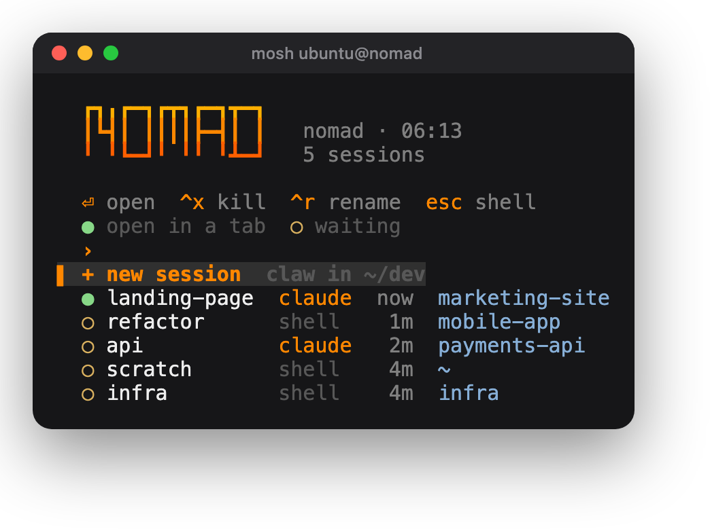

<div align="center">



<h1>🏜️ nomad</h1>

**Your dev box, in your pocket.**<br>
A hardened, always-on AWS box you reach from your phone over Tailscale.<br>
Leave the laptop. Build from anywhere.


</div>

---

## ✨ What you get

- 🪄 **One command from zero.** Clone, `make up`, done. Safe to re-run anytime.
- 🔒 **Zero public inbound.** No open ports, no SSH keys. Your tailnet is the only door.
- 📱 **Phone-first.** Termux + mosh + tmux, tuned for thumbs and flaky connections.
- 🗂️ **A session menu on every login.** Each tab picks its own session; new ones start Claude Code.
- 🔑 **One `auth` command for every sign-in**, with short links you can actually type on a phone.
- 🗣️ **Claude's replies read aloud on your phone** (`yap`), if you want them.
- 🧰 **The toolbox:** gcloud, AWS, GitHub, Vercel and Claude Code CLIs, Node, Bun, Deno, Rust, Go, language servers.

## 🚀 Start

You need an AWS account and a Tailscale account (both free to start; `make up`
helps you create either). Clone this repo on a Mac or Linux computer, then:

```sh
cd nomad
make up
```

That's it. `make up` installs what your computer is missing (AWS CLI, Terraform,
Tailscale), signs you in, asks for your settings once, creates the box, waits
for it to join your tailnet and installs everything on it, one ✓ per step.
The first time, it asks for a Tailscale API token so the box can join your
tailnet (see *How the box joins your tailnet* below). It takes about 6 minutes.

## 📱 Connect

**From your computer:** `mosh nomad` (or `ssh nomad`).

**From your Android phone,** once:

1. **Install Tailscale** and sign in with the same account as your computer.

   [](https://play.google.com/store/apps/details?id=com.tailscale.ipn)

2. **Install Termux.** Pick F-Droid if you want Claude's replies read aloud
   (Google Play has no Termux:API); any of them works for everything else.

   [](https://f-droid.org/packages/com.termux/)
   [](https://play.google.com/store/apps/details?id=com.termux)
   [](https://github.com/termux/termux-app/releases/latest)

3. **Open Termux and paste this** (tap the copy button):

   ```sh
   curl -fsSL https://raw.githubusercontent.com/tylerthebuildor/nomad/main/phone/setup.sh | bash -s nomad
   ```

That's it. It sets up the rest (mosh, the `nomad` shortcut, an extra-keys row,
tappable links) and asks two things: read Claude's replies aloud, and open your
box whenever you open Termux. Every step is commented in
[phone/setup.sh](phone/setup.sh); add `--remove` to the end to undo it.

**iPhone:** in Blink Shell or Termius, add host `nomad`, user `ubuntu`, and
connect with mosh. **A second box:** use its name instead of `nomad`.

## 🗂️ Every login: the session menu

You land in a menu of running tmux sessions: what each is running (like
`claude`), where, and when you last used it. Pick one to land right back where
you left off, or **+ new session** to start Claude Code (`claw`) in `~/dev`. So
each Termux tab can work on something different.

| Key | Does |
|---|---|
| <kbd>enter</kbd> | open the session, or start a new one |
| <kbd>ctrl</kbd> <kbd>x</kbd> · <kbd>ctrl</kbd> <kbd>r</kbd> | kill · rename it |
| <kbd>esc</kbd> | plain shell, no menu |
| *type* | filter |
| <kbd>ctrl</kbd> <kbd>b</kbd> then <kbd>S</kbd> | the menu again, from inside tmux |
| <kbd>ctrl</kbd> <kbd>b</kbd> then <kbd>d</kbd> | leave; the session keeps running |

`●` is open in a tab, `○` is waiting for you. `t <name>` jumps straight to a session.

## 🗣️ Hear Claude on your phone: `yap`

Say yes to **voice** in the phone setup and Claude's replies are read aloud on
your phone, through Android's voice on the media volume: handy while driving or
cooking. Markdown is flattened, and code blocks and links are named rather than
read out. Voice needs one more free app, **Termux:API**; if you do not have it,
the setup opens its download page and waits while you install it (or you skip
it, and everything else works as usual).

Ask Claude "turn yap off" (or on), or run `yap off`, `yap on`, `yap stop`
(cut off the current reply) and `yap status` on the box. Your phone listens to
the box over your tailnet and only ever speaks; it never runs anything the box
sends.

## 🔑 Signing in: `auth`

Run `auth` on the box (or <kbd>ctrl</kbd> <kbd>b</kbd> then <kbd>A</kbd>) for a
board of your sign-ins: ✓ or ✗ for gcloud, AWS, GitHub, Vercel and Claude Code.
Pick one and you get a short link, `http://nomad:8085`, to open on your phone;
sign in, and paste the code back if asked. The link works only on your tailnet,
only while you sign in, and lands on the service's real sign-in page.

When Google Cloud expires (often daily), Claude notices and pops the sign-in up
for you. `auth gcloud` (or `gauth`) does one service directly.

## 🧭 Commands

Run these on your computer, in this folder.

| | |
|---|---|
| `make up` | create or update the box, then install everything (safe to re-run) |
| `make down` | destroy the box (you type its name), and offer to remove it from your tailnet |
| `make bootstrap` | re-run just the install step on the box (~20 seconds when up to date) |
| `make settings` | change your git name/email and sign-in accounts |
| `make lock` | turn on tailnet lock (new devices need your approval) |
| `make ssh` | connect without the shortcut |
| `make plan` | preview infrastructure changes |

A second box: `make up PROJECT=work REGION=us-west-2`. It gets its own name,
tailnet entry, shortcut and state.

## 🔐 Security, set up for you

- 🔏 **Tailnet lock** (`make lock`; `make up` offers it for a new box): a new
  device can join your tailnet only when **your computer** approves it, so a
  stolen Tailscale login cannot add one. Your computer is the only signer, never
  the box. You get 10 recovery secrets to save in your password manager (any one
  turns the lock off), and one more goes to Tailscale support as a backstop.
  New boxes are approved automatically by `make up`; a new phone or laptop
  needs one approval from your computer (the admin console shows the command).
- ⏳ **Key expiry off on the box**, so it never drops off the tailnet. Leave it on
  for your phone and laptop, so a lost device expires by itself.
- 🔁 **SSH check mode off** (with your OK), so connecting never stops for a
  browser re-approval every 12 hours.

One thing only you can do: 🗝️ **protect the account you sign in to Tailscale
with** (Google, GitHub, Microsoft or Apple) with a passkey or two-factor. With
Tailscale SSH there are no SSH keys, so that login is the front door.

---

## 📖 Reference

<details>
<summary><b>How the repo is laid out</b></summary>

```
Makefile     every command (make up, down, bootstrap, settings, lock, check)
scripts/     what make runs on your computer: checks, settings, Terraform, Tailscale
terraform/   the AWS infrastructure
box/         everything installed on the box: setup.sh, the t, auth and yap
             commands, sign-in services (box/auth/), Claude's skills
phone/       setup.sh for Termux on your phone
lib/ui.sh    the shared look (colors, the nomad header)
config/      your settings; only the .example files are committed
```

</details>

<details>
<summary><b>What <code>make up</code> builds</b></summary>

| | |
|---|---|
| 🛡️ **Network** | Its own VPC with **zero public inbound**: the security group has no ingress rules; outbound is open for installs and Tailscale. |
| 💻 **Instance** | **t4g.large (ARM/Graviton), Ubuntu 24.04**, 100 GB **encrypted** gp3 disk. |
| 🔗 **Access** | First boot installs Tailscale and mosh, joins **your** tailnet with Tailscale SSH as `nomad`, and turns off the regular SSH server. |
| 📦 **Then** | Over the tailnet: the CLIs and languages, the session menu, `auth`, Claude Code and its nomad skills, your git identity and settings, tmux tuned for phones. |

Terraform state lives in an S3 bucket created for you (encrypted, versioned,
private), named after your account and region.

</details>

<details>
<summary><b>How the box joins your tailnet</b></summary>

The first time, `make up` opens Tailscale's keys page and asks for an **API access
token**: click **Generate access token…**, description `nomad`, expiry **1 day**.
With it, `make up` makes a single-use join key, checks nothing on your tailnet
already uses the name (and offers to remove an old box that does), turns off the
box's key expiry once it joins, and offers to turn off SSH check mode. With
tailnet lock on, your computer approves the new box as it joins. The token is only kept in memory for that
run. It has no permission settings (it acts as your account), hence the short
expiry.

Prefer not to use a token? Press enter at the prompt and paste a single-use
**auth key** instead (Settings → Keys → Generate auth key), then turn off key
expiry yourself: Machines → nomad → Disable key expiry.

</details>

<details>
<summary><b>Your settings and accounts</b></summary>

`make up` asks once, filling in what it finds on your computer, and saves to
`config/` (gitignored; each file has a documented `.example`):

- `config/git.env`: your git name and email, set on the box so commits are yours.
  Use the email on your GitHub/Vercel account: without it, commits are authored
  as `ubuntu@nomad`, which GitHub won't attribute and Vercel rejects.
- `config/auth.env`: the Google account to preselect, the GitHub/Vercel accounts
  you expect, the email to prefill for Claude, and how AWS signs in (`keys`,
  `login` for console/root sign-in, or `sso`).

`make settings` changes them; `make bootstrap` sends them to the box.

**git push over SSH** needs a key on the box: either run `gh auth setup-git`
after `auth gh` (git then uses your GitHub sign-in over HTTPS), or copy an SSH key
to the box's `~/.ssh/`.

</details>

<details>
<summary><b>Sign-ins: what lasts how long</b></summary>

| Service | Lasts |
|---|---|
| ☁️ **gcloud** (CLI + Application Default Credentials, one sign-in) | often ~1 day (your org's policy) |
| 🟧 **aws** | keys: until rotated · console/SSO sign-in: ~8-12h |
| 🐙 **gh** | doesn't expire |
| ▲ **vercel** | long-lived |
| 🤖 **claude** | long-lived (or ~1 year with `claude setup-token`) |

`auth --status` prints them all as plain text. Adding another service is one
file in `box/auth/`: see [box/auth/README.md](box/auth/README.md).

</details>

<details>
<summary><b>Re-runs, output and logs</b></summary>

`make up` keeps one box per project and region: re-runs update it and never add
or replace it (Ubuntu patches itself in place). Already-installed tools are
skipped, so a re-run takes seconds. Terraform asks a simple Y/n to create or
change things; if a run would destroy or replace anything, it shows the full plan
and has you type the box's name.

Each step prints one line: ✓ done ("new" when just installed), – skipped, ! needs
you, ✗ failed with its last lines. The full install log is on the box at
`~/.cache/nomad/setup.log`. `SKIP_BOOTSTRAP=1 make up` stops after Terraform.

</details>

<details>
<summary><b>Region, size, and recovery</b></summary>

- **Region**: us-east-1 by default; `make up REGION=us-west-2` for the West Coast
  (avoid us-west-1).
- **Bigger box**: set `instance_type` (e.g. `m7g.xlarge`) in
  `terraform/terraform.tfvars` and `make up`: a quick stop/start, your disk is
  kept. `root_volume_gb` grows live. Stay on ARM (Graviton) types.
- **Locked out**: Tailscale is the only door, by design. A box with nothing on it
  yet: `make down && make up`. Otherwise stop the instance and attach its disk to
  a throwaway instance, or temporarily enable EC2 Serial Console in the AWS
  console. Do not leave a second door open afterwards.

</details>

---

<div align="center">
<sub>Built for thumbs. 🏜️ Go somewhere nice.</sub>
</div>
